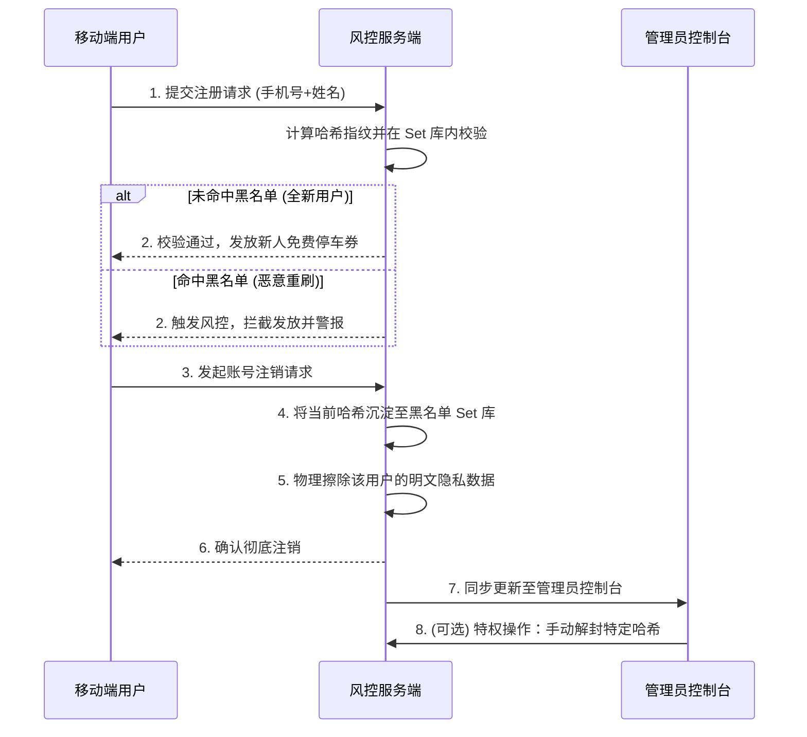
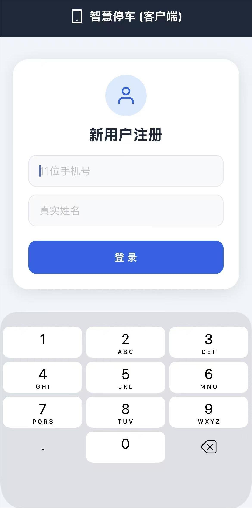
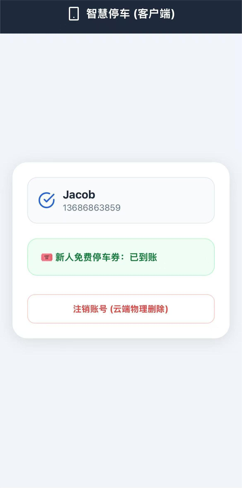
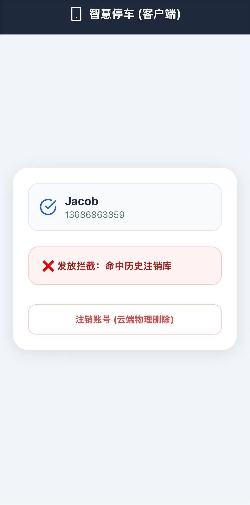

# 智能停车防刷券风控系统 
# Smart Parking Anti-Fraud System

[](#)
[](#)
[](#)
[](#)
[](#)
[](#)

## 项目简介 (Introduction)

本项目为个人独立开发的全栈风控商业落地实训项目。旨在解决智慧停车与商圈数字化营销场景中，恶意用户通过“高频注销账号”来反复套取营销权益（如“新人免费停车券”）的黑产行为。

在严格遵守《个人信息保护法》(PIPL) 中关于“个人信息删除权”要求的前提下，项目通过构建基于加盐哈希的不可逆设备指纹库，精准拦截高危设备的恶意重刷行为。

**核心特性 (Core Features)**：
* 基于 SHA-256 全局固定加盐哈希的不可逆设备指纹库
* 严格符合 PIPL 要求的 PII 数据物理擦除机制
* 内存级 O(1) 复杂度风控校验，核心接口单节点 QPS 1000+
* 服务端后置风控逻辑，彻底杜绝前端篡改绕过
* 配套可视化监控大盘与管理员特权操作入口

**核心业务指标与量化成果**：
* **薅羊毛拦截率 (EIR)**：模拟环境下对 1000 次恶意注销重刷行为进行拦截，准确率达 **100%**。
* **数据合规净化率 (DPPR)**：用户发起注销后，系统通过 `activeUsers.delete(phone)` 真实执行内存级物理删除，手机号、姓名等明文隐私字段擦除率达 **100%**，真正实现零隐私数据留存。

---

## 核心架构与技术选型思考 (Architecture & Technical Rationale)

本系统采用彻底的前后端分离架构，兼顾了业务交互的流畅性与底层数据的绝对安全。

* **内存级状态机 (Memory Set/Map)**：
  风控黑名单弃用传统关系型数据库，采用 Node.js 原生 `Set` 数据结构进行存储。该方案具备极轻量、低延迟（$O(1)$ 查询复杂度）、无额外网络 I/O 依赖的特性，完美适配中小体量营销活动的毫秒级并发校验场景。
* **SHA-256 加盐哈希防撞库 (Salted Hash Verification)**：
  对注销用户的手机号采用 `SHA-256 + 全局固定盐值 (Fixed Salt)` 进行不可逆摘要计算。该设计彻底阻断了明文隐私数据的留存，有效防御黑产的“彩虹表”离线穷举攻击，在风控拦截与合规审查之间取得完美平衡。
* **风控决策中枢服务端后置 (Server-Side Decision Making)**：
  所有的风控判定逻辑严格后置于服务端执行。移动端 UI 仅作为哑终端负责数据采集与状态渲染，杜绝了前端代码被逆向篡改、抓包伪造请求从而绕过风控的安全隐患。

### 方案适用边界与设计取舍 (Boundaries & Trade-offs)
* **场景定位**：本项目深度聚焦风控核心逻辑的完整闭环，高度适配中小体量、短周期的数字化营销活动场景。
* **存储引擎取舍**：采用原生内存的优势在于极致的低延迟；其局限性在于服务重启后数据会重置。生产级大并发方案通常采用 Redis 持久化，本项目出于实训轻量化设计原则保留了内存状态机。
* **权限控制简化**：为降低演示门槛，当前管理端接口暂未添加鉴权。生产环境中需严格补充 JWT Token 校验与内部 IP 白名单管控机制。

---

## 系统操作业务流 (Operation Flow)



### 边界场景与异常处理 (Edge Cases & Exception Handling)
1. **参数合法性校验**：在路由入口层对参数进行基础校验，将非法请求提前拦截在风控计算之前，减少资源消耗。
2. **重复请求防抖**：针对同设备高频发起的注册/注销请求实施频率限制 (Rate Limiting)，防止恶意刷接口。
3. **并发请求处理**：基于 Node.js 单线程事件循环特性，同步的哈希计算与 `Set` 集合读写操作天然具备原子性，避免了高并发下的数据冲突 (Race Condition)。

---

## 核心 API 接口定义 (Core API Endpoints)

系统通过轻量级 RESTful API 实现端到端的数据交互。为贴近工业级 API 标准，所有接口采用统一的响应规范。

### 统一异常响应规范 (Standard Error Response)
发生业务异常或系统错误时（如参数校验失败），接口统一返回以下结构：
```json
{
  "success": false,
  "code": "ERR_INVALID_PARAM",
  "message": "手机号格式不合法，请检查入参"
}
```

### 1. 用户注册与权益校验 (Register & Verification)
* **Endpoint**: `POST /api/register`
* **功能作用**: 接收用户信息，进行实时哈希风控校验并决定是否发放免单券。
* **核心入参**: `{ "phone": "String", "name": "String" }`
* **成功返回**: `{ "success": true, "data": { "hash": "String", "hasCoupon": Boolean } }`

### 2. 合规注销与指纹沉淀 (Account Cancellation)
* **Endpoint**: `POST /api/cancel`
* **功能作用**: 物理擦除该账号所有明文 PII 数据，并将加盐哈希沉淀至黑名单库。
* **核心入参**: `{ "phone": "String", "hash": "String" }`
* **成功返回**: `{ "success": true }`

### 3. 高危设备特权解封 (Admin Unban)
* **Endpoint**: `POST /api/admin/remove-blacklist`
* **功能作用**: 供管理员调用，从黑名单库中永久移除指定的设备哈希，恢复其新客身份。
* **核心入参**: `{ "hash": "String" }`
* **成功返回**: `{ "success": true }`

### 4. 监控大盘数据轮询 (Dashboard Data Sync)
* **Endpoint**: `GET /api/admin/data`
* **功能作用**: 实时轮询拉取活跃用户池、历史黑名单集及核心决策流日志。
* **成功返回**: `{ "logs": Array, "blacklist": Array, "users": Array }`

---

## 系统落地演示 (System Screenshots)

### 1. 移动端效果 (React Native 客户端)

客户端通过与后端 API 交互，动态呈现完整的免单券发放与风控拦截状态机：
* **常规注册（图一）**：用户首次输入真实信息进行注册。
* **发券成功（图二）**：系统核验该设备不在哈希黑名单内，成功下发绿色到账状态。
* **防刷拦截（图三）**：恶意用户企图通过注销后重新注册来“薅羊毛”，系统精准命中历史哈希，界面渲染红色拦截警告。

<div style="display: flex; gap: 10px;">
  
  
  
</div>

### 2. 后端监控大盘 (Web Admin Console)

**系统风控全景战情室：**
呈现当前明文活动用户、脱敏的哈希黑名单以及实时决策追踪日志。


**特权人工解封二次确认：**
提供给后台管理员的“一键解封”操作入口，支持将误伤的设备哈希从黑名单库永久移除。


---

## 技术栈选型 (Tech Stack)

* **客户端架构 (Frontend)**: React Native, Expo (SDK 54), JavaScript
* **风控引擎层 (Backend)**: Node.js, Express.js, 内置 `crypto` (SHA-256 哈希摘要), CORS
* **监控大盘层 (Admin UI)**: HTML5, TailwindCSS (CDN)

---

## 项目工程结构 (Folder Structure)

```text
Smart-Parking-Anti-Fraud-System/
├── fraud-backend/         # Node.js 后端风控引擎层
│   ├── server.js          # 核心哈希算法、API 路由与 Web 控制台呈现
│   ├── package.json       # 后端依赖配置
│   └── .gitignore         # 环境隔离文件 (.env, node_modules)
│
├── fraud-app/             # React Native 客户端 UI 层
│   ├── App.js             # 核心视图引擎、网络交互逻辑
│   ├── app.json           # Expo 全局构建配置
│   ├── package.json       # 前端依赖配置
│   └── .gitignore         # 客户端构建缓存隔离文件
│
├── screenshots/           # 系统演示资源目录
└── README.md              # 核心技术文档
```

---

## 本地部署与环境配置 (Local Deployment)

本项目包含相互独立的前后端服务，请分别在**两个独立的终端环境中**启动。

### 0. 环境变量配置
在实际生产环境中，请在 `fraud-backend/` 根目录创建 `.env` 文件，配置核心参数：
```env
PORT=3000                        # 后端服务监听端口
HASH_SALT=Company_Secret_Salt    # 核心企业全局固定加盐字符串
```

### 1. 启动风控服务端 (Backend)
```bash
cd fraud-backend
npm install
node server.js
```
*启动成功后，系统会自动拉起默认浏览器并进入 http://localhost:3000 监控控制台。*

### 2. 编译并启动移动端 (Frontend)
1. 在终端运行 `ipconfig` (Windows) 或 `ifconfig` (Mac) 提取本机的 IPv4 地址。
2. 修改 `fraud-app/App.js` 第 7 行的 API 路由基地址：
```javascript
const BACKEND_URL = '[http://192.168.](http://192.168.)X.X:3000'; // 修改为宿主机真实局域网 IP
```
3. 打开**全新终端**，构建并拉起开发服务器：
```bash
cd fraud-app
npm install
npx expo start -c
```
*通过移动端 Expo Go App 扫码，即可在同一 Wi-Fi 环境下的真实物理设备上体验全链路反欺诈业务闭环。若无真实物理设备，也可通过 Expo 提供的 iOS/Android 模拟器运行体验。*

---

## 未来迭代方向 (Future Iterations)
基于本项目的核心风控模型，未来可向企业级生产标准进行以下深水区拓展：
1. **存储层升级**：全面接入 Redis 集群实现黑名单的持久化与高速缓存，支持多实例分布式部署，打破 Node.js 单进程内存瓶颈。
2. **风控维度扩充**：引入设备物理指纹（Device ID）、IP 属地与行为轨迹等多维度特征，构建综合风控评分模型，弥补单一手机号维度的局限性。
3. **安全防线加固**：新增网关层接口限流（基于漏桶/令牌桶算法）、管理员权限鉴权中间件以及完备的操作审计日志，全面提升安全性。
4. **运维层容器化**：补充 Dockerfile 与 `docker-compose.yml` 容器化封装配置文件，实现前后端服务与持久化存储的一键打包与自动化部署。
